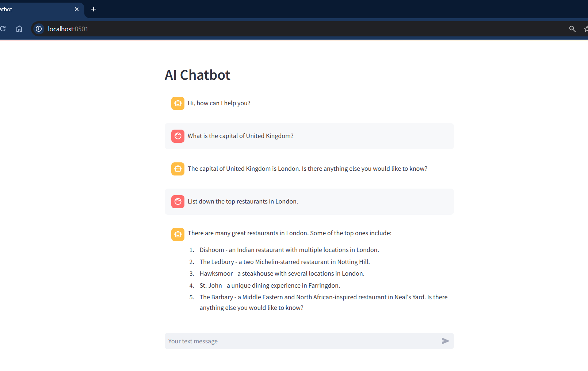

# AI-Chatbot

The script acts as an AI chatbot where the user will ask questions to the bot and the bot will reply with the appropriate answer. 
The script downloads the model into the local machine in which the code runs. 
The web app used to envelop the model is streamlit to provide the smooth interface between the AI model and the user 

  
Below is the screenshot of the interaction with the Chatbot.
  

  
Python used here has version : 3.8.17 
The relevant Python packages used in this Chatbot are specified in the pip_requirements.txt file.